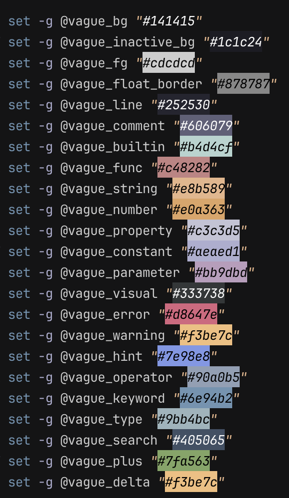

# Vague.tmux

A color-only tmux theme based on [vague.nvim](https://github.com/vague2k/vague.nvim). Preserves your existing tmux configuration.



## Installation

Using [TPM](https://github.com/tmux-plugins/tpm):

```bash
set -g @plugin 'Jefferson-Butler1/Vague.tmux'
```

Manual install:

```bash
git clone https://github.com/Jefferson-Butler1/Vague.tmux ~/.tmux/plugins/Vague.tmux
run-shell ~/.tmux/plugins/Vague.tmux/vague.tmux
```

Standalone config:

```bash
source-file ~/.config/tmux/vague.conf
```

## Configuration

Override colors:

```bash
set -g @vague_bg "#0f0f0f"
set -g @vague_keyword "#5e84a2"
```

Available colors:

- `@vague_bg` (#141415)
- `@vague_inactive_bg` (#1c1c24) 
- `@vague_fg` (#cdcdcd)
- `@vague_float_border` (#878787)
- `@vague_line` (#252530)
- `@vague_comment` (#606079)
- `@vague_builtin` (#b4d4cf)
- `@vague_func` (#c48282)
- `@vague_string` (#e8b589)
- `@vague_number` (#e0a363)
- `@vague_property` (#c3c3d5)
- `@vague_constant` (#aeaed1)
- `@vague_parameter` (#bb9dbd)
- `@vague_visual` (#333738)
- `@vague_error` (#d8647e)
- `@vague_warning` (#f3be7c)
- `@vague_hint` (#7e98e8)
- `@vague_operator` (#90a0b5)
- `@vague_keyword` (#6e94b2)
- `@vague_type` (#9bb4bc)
- `@vague_search` (#405065)
- `@vague_plus` (#7fa563)
- `@vague_delta` (#f3be7c)

## Requirements

tmux 2.9+

## Contributing

PR's welcome.